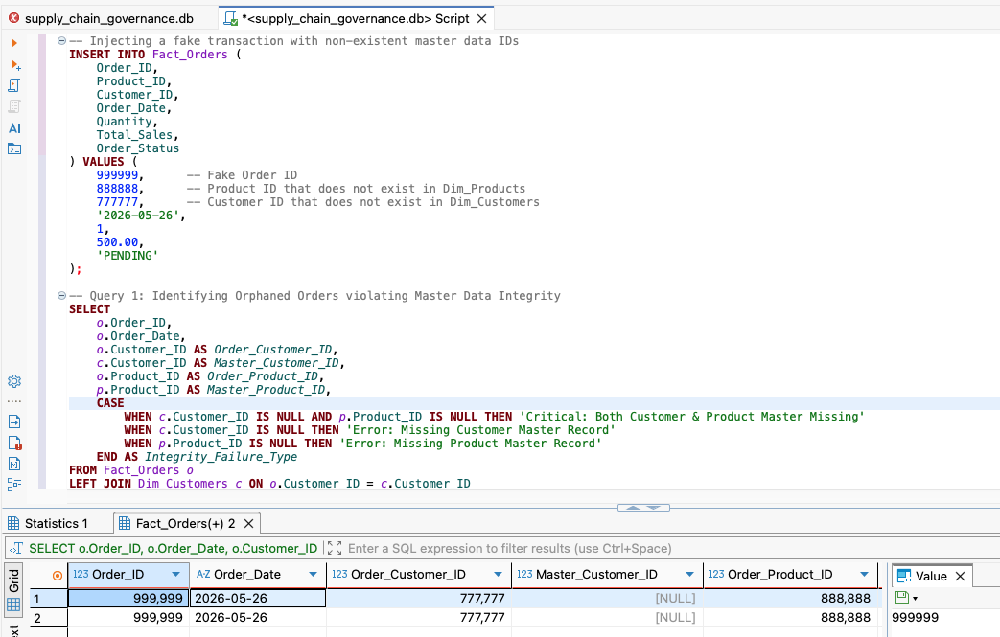
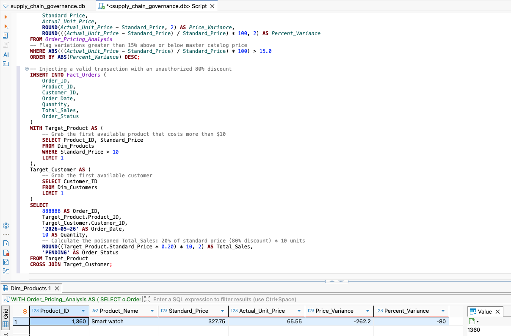
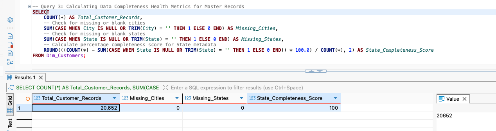

# Master Data Governance: Supply Chain Data Profiling & Anomaly Detection

## 📌 Project Overview
In complex enterprise environments, transactional systems frequently outpace master data management (MDM) provisioning, leading to orphaned records, pricing anomalies, and downstream reporting failures. 

This project simulates a Master Data Governance (MDG) environment for a multi-regional supply chain. By migrating a flat raw dataset into a standard relational schema, I used automated SQL data-profiling scripts to detect referential integrity violations, monitor catalog pricing compliance, and score structural data completeness.

## 🗄️ Database Architecture
The dataset was extracted from the DataCo Smart Supply Chain database and normalized into a localized SQLite relational structure. It isolates transactional metrics from core master data domains to enforce strict governance rules.

### Entity Relationship Model
* **`Dim_Products` (Master):** Unique product catalog featuring standard pricing and category hierarchies.
* **`Dim_Customers` (Master):** Unique customer records including geographic routing data.
* **`Fact_Orders` (Transactional):** Central ledger logging procurement events, quantities, and actual billed amounts.

## 🛠️ Data Quality Queries & Anomaly Detection

### 1. Referential Integrity Profiler (Detecting "Orphaned" Transactions)
**The Business Risk:** Transactional systems (like an ERP or Point of Sale) generating orders with Customer or Product IDs that have not been officially provisioned in the master data hub. This breaks automated accounts payable and regional supply chain reporting.
**The Solution:** A `LEFT JOIN` anomaly detector that flags sales records missing corresponding master data.

> **Note:** The above test features an intentionally injected transaction (Order #999999) to demonstrate the automated flagging of missing Customer and Product master records.

### 2. Product Attribute Validator (Extreme Pricing Deviations)
**The Business Risk:** Unauthorized manual overrides of product pricing at the point of sale, or critical data entry errors leading to severe revenue leakage. 
**The Solution:** A Common Table Expression (CTE) that calculates the actual unit price from transactions and cross-references it against the approved `Standard_Price` in the master catalog. It automatically flags any transaction deviating by more than 15%.

### 3. Metadata Completeness Scoring
**The Business Risk:** Missing geographic metadata (like City or State) prevents automated tax calculations and regional logistical routing. 
**The Solution:** A profiling query that aggregates `NULL` and blank values across structural fields to generate an executive "Completeness Score," allowing the governance team to track remediation progress over time.

## 🚀 Technical Stack
* **Database:** SQLite 3
* **IDE/Query Execution:** DBeaver, Visual Studio Code
* **Language:** SQL (DDL for table creation, DML for anomaly injection, and DQL for data profiling)

## 📁 Repository Structure
* `01_data_split_migration.sql`: The DDL scripts used to split the raw CSV into the 3-table relational schema.
* `02_data_quality_profiling.sql`: The heavily commented SQL script containing the automated anomaly detection queries.